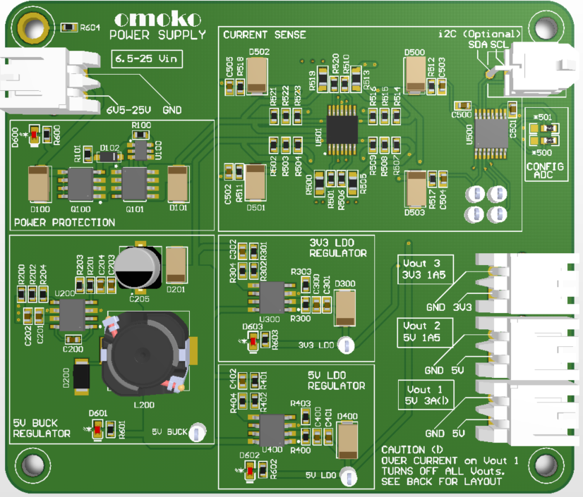
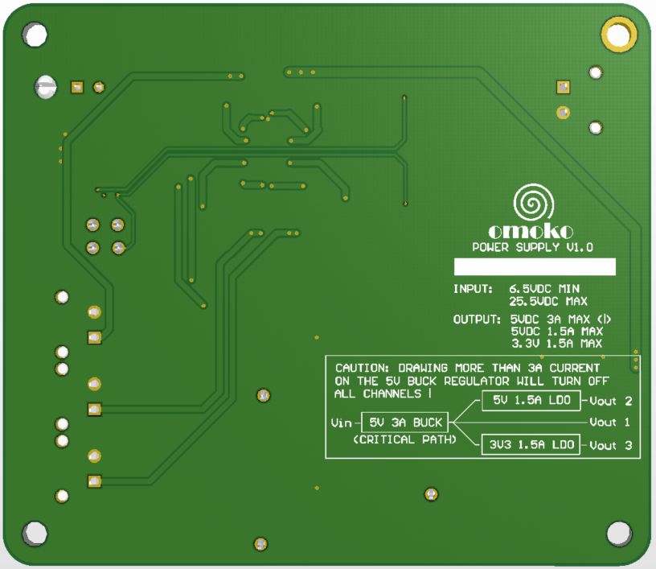

**omoko Power Supply Board**

## About the PCB
A power supply board for the personal projects. It is a 4-layer board that provides 5V and 3.3 outputs.

## Requirements
1. Input: 6.5V-25.5V DC.
2. Output: 3 channels: 5V high current, V low current, 3.3V low current.
3. Current sensor measurement: Each 3 output channels measured and communicated over i2C
4. Connectors: Power connectors: Molex Mighty SPOX, Data connectors: Molex Micro-fit

## Current revision
Version 1.0

## Future versions
1. Add voltage measurement features
2. Add temp sensor to measure board temperature
3. Make the channels fully independent
